# Taller #2 Módulo 2: Consultas Básicas en SQL (SELECT, FROM, WHERE, GROUP BY, FUNCIONES DE AGREGACION)

Base de datos: Sakila

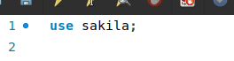

1. ¿Cuántas películas tienen una calificación de clasificación 'PG'?

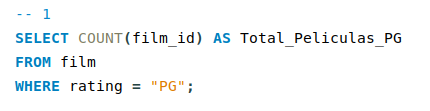

2. ¿Cuántos alquileres se realizaron en cada día de la semana?

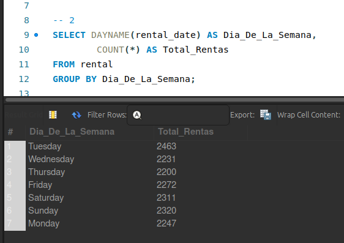

3. ¿Cuál es la película con el título más largo?

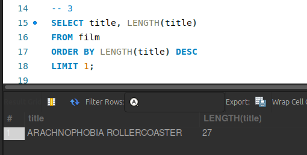

4. Listar los apellidos de los actores y el número de actores que tienen ese 
apellido, pero solo para los apellidos que son compartidos por al menos dos 
actores.

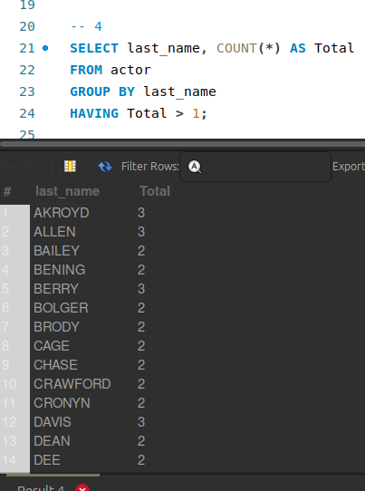

5. El actor HARPO WILLIAMS fue accidentalmente ingresado en la tabla de 
actores como GROUCHO WILLIAMS, el nombre del esposo del segundo 
primo de Harpo. Escribe una consulta para corregir el registro.

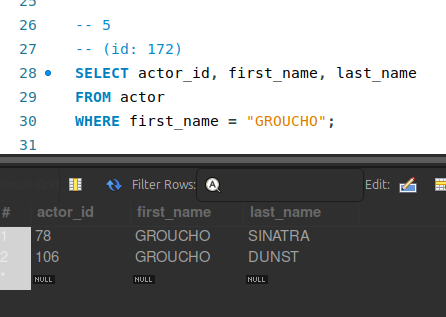
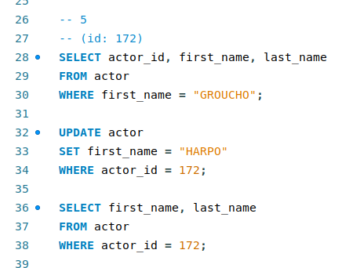

6. ¿Qué actores tienen el nombre 'Scarlett'?

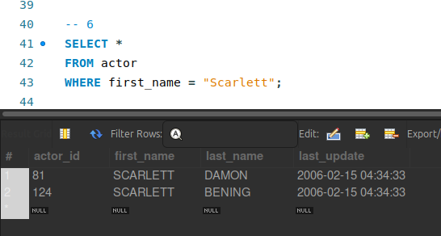

7. ¿Qué actores tienen el apellido 'Johansson'?

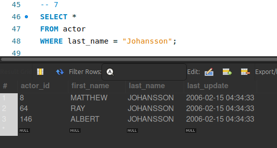

8. ¿Cuántos apellidos distintos de actores hay?

9. ¿Qué apellidos no se repiten?

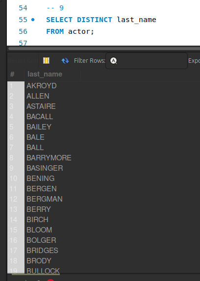

10. ¿Qué apellidos aparecen más de una vez?

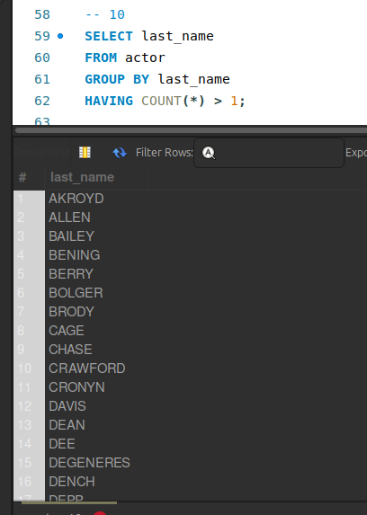

11. ¿Cuántas películas tienen una duración mayor a 120 minutos?

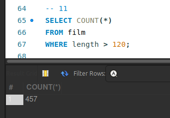

12. ¿Cuántos clientes se registraron después del año 2020?

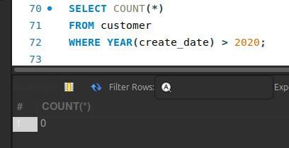

13. ¿Cuántos alquileres de películas se realizaron por mes y por año?

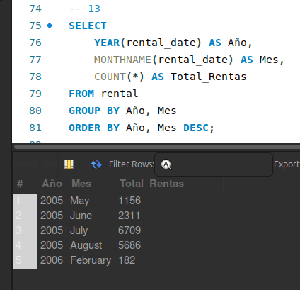

14. ¿Cuántas películas tienen una clasificación de "R" y una duración menor a 
90 minutos?

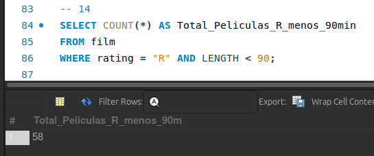

15. ¿Cuántos actores tienen un nombre que comienza con la letra "A"?

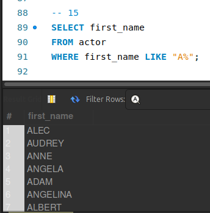

